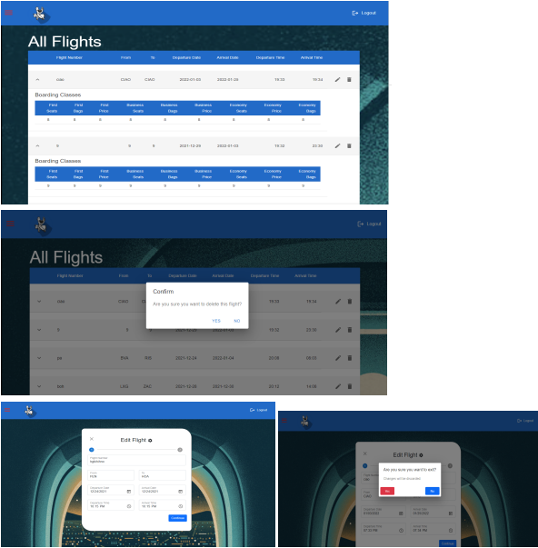

# Flight-Booking-Website with MERN

README: BeefOrChicken (BOC) Airlines
Project Title:

Airline Reservation System. A web application for Beef or Chicken airlines through which
individuals can reserve and pay for flights in order to travel to different countries and
sometimes domestic cities.

Motivation:
This application was created to help Beef or Chicken airlines customers to search for flights,
reserve seats, and pay for flights in order to travel to different countries and sometimes
domestic cities easily and efficiently.

Screeshots : 

Build Status:
Stripe API, used for payment, is unstable so users need to refresh the page if they encounter
an error.

Code Style:
Standard style where we indent inside all methods / classes / functions equal indentations
and if else & while nested blocks have extra indentations than the outside tag.
Curly brace start right next to the methods’ signatures (inline).
Variables , constans and functions names have a naming convention where they are all of
camel cases if they are composed of more than one word and we try to be as descriptive &
concise as possible when picking the names. No digits are used in names as much as
possible .
Errors return with a descriptive message of the error source
Functions Length is not too long otherwise you would need to use a helper method
Comments are added whenever possible to specify what the function/api call is used for to
be easily understandable by future open source contributors that wish to contribute.

Tech/Framework used:
MERN stack (MongoDB, Express JS, React JS and Node JS)
React Bootstrap Framework
Stripe Framework
Material UI Framework

Features:
-A user can create an account / login / view their profile / edit their profile details / change
their password
- Users can make their reservations in an easily understandable flow where they specify
their destination , where they are travelling from and their travelling dates.
When reserving, they get to choose departure and return flights that suits them best and
falls under their budget based on the number of passengers they are reserving for and the
cabin class.
- Users can pick the seats they find most suitable when reserving while getting a glimpse on
where it will actually be in the actual plane.
- Users can pay for their reservation using their credit cards in a convenient way.
- Users can view their reservations at any time and can choose to send themselves their
iternary by email .
- Users can cancel their reservations at any time and they will be refunded with the whole
amount
- Users can choose to edit their reservations.
- Admins can create , edit , delete and view all flights at any time.
Code Examples:
Flight attributes:
const flightSchema = new Schema({
FlightNumber: {
unique:true,
type: String,
required: true
},
From: {
type: String,
required: true,
},
To: {
type: String,
required: true
},
DepartureDate: {
type: Date,
required: true,
},
ArrivalDate: {
type: Date,
required: true,
},
EconomySeats: {
type: Number,
required: true
},
BusinessSeats: {
type: Number,
required: true
},
FirstSeats: {
type: Number,
required: true
},
EconomyBags: {
type: Number,
required: true
},
BusinessBags: {
type: Number,
required: true
},
FirstBags: {
type: Number,
required: true
},
PriceEconomy: {
type: mongoose.Decimal128,
required: true
},
PriceBusiness: {
type: mongoose.Decimal128,
required: true
},
PriceFirst: {
type: mongoose.Decimal128,
required: true
},
DepartureTime: {
type: String,
required: true
},
ArrivalTime: {
type: String,
required: true
},
RemEconomy: {
type: Number,
required: true
},
RemBusiness: {
type: Number,
required: true
},
RemFirst: {
type: Number,
required: true
},
EconomySeatsArray:{
type:Array,
required:true
},
BusinessSeatsArray:{
type:Array,
required:true
},
FirstSeatsArray:{
type:Array,
required:true
},
}, { timestamps: true });
Reservation schema:
const reservationSchema = new Schema({
UserID: {
type: String,
required: true,
},
DepartureFlightID: {
type: String,
required: true
},
ReturnFlightID: {
type: String,
required: true
},
CabinType: {
type: String,
required: true
},
TakenSeatsDeparting: {
type: Array,
required: false,
},
TakenSeatsArriving: {
type: Array,
required: false,
},
TotalPrice: {
type: mongoose.Decimal128,
required: true,
},
//ReservationNumber: {
// type: String,
//required: true,
//},
Children: {
type: Number,
required: true,
},
Adults: {
type: Number,
required: true,
},
Number:{
type: String,
required:true,
}
}, { timestamps: true });
User Attributes:
username: {
unique:true,
type: String,
required: true,
},
email: {
type: String,
required: true,
},
password: {
type: String,
required: true
},
type: {
type: Number,
required: true
},
firstName: {
type: String,
required: true
},
lastName: {
type: String,
required: true
},
passportNumber: {
type: String,
required: true
},
reservations: {
type: Array,
required: true
},
address: {
type: String,
required: false
},
telephone1: {
type: String,
required: true
},
telephone2: {
type: String,
required: false
},
}, { timestamps: true });
Installation:
Necessary node modules:
BackEnd:
"axios": "^0.24.0",
"bcrypt": "^5.0.1",
"body-parser": "^1.19.0",
"connect": "^3.7.0",
"cors": "^2.8.5",
"dotenv": "^10.0.0",
"express": "^4.17.1",
"i": "^0.3.7",
"jsonwebtoken": "^8.5.1",
"mongo": "^0.1.0",
"mongoose": "^6.0.12",
"mongoose-auto-increment": "^5.0.1",
"nodemailer": "^6.7.2",
"nodemon": "^2.0.15",
"react": "^17.0.2",
"stripe": "^8.195.0",
"uuidv4": "^6.2.12"
FrontEnd:
"@date-io/date-fns": "^1.3.13",
"@emotion/react": "^11.5.0",
"@emotion/styled": "^11.3.0",
"@material-ui/core": "^4.12.3",
"@material-ui/icons": "^4.11.2",
"@material-ui/lab": "^4.0.0-alpha.60",
"@material-ui/pickers": "^3.3.10",
"@mui/icons-material": "^5.0.5",
"@mui/material": "^5.0.6",
"@mui/styles": "^5.2.0",
"@mui/x-data-grid": "^5.0.1",
"@mui/x-data-grid-generator": "^5.0.1",
"@stripe/react-stripe-js": "^1.7.0",
"@stripe/stripe-js": "^1.22.0",
"@testing-library/jest-dom": "^5.11.4",
"@testing-library/react": "^11.1.0",
"@testing-library/user-event": "^12.1.10",
"airportsjs": "^0.3.1",
"aws-sdk": "^2.1048.0",
"axios": "^0.24.0",
"bcrypt": "^5.0.1",
"bcryptjs": "^2.4.3",
"body-parser": "^1.19.1",
"bootstrap": "^5.1.3",
"date-fns": "^2.26.0",
"dateformat": "^5.0.2",
"email-validator": "^2.0.4",
"is-phone": "^2.0.0",
"material-ui-icons": "^1.0.0-beta.36",
"mock-aws-s3": "^4.0.2",
"moment": "^2.29.1",
"mongoose": "^6.1.3",
"nock": "^13.2.1",
"nodemailer": "^6.7.2",
"react": "^17.0.2",
"react-alert": "^7.0.3",
"react-bootstrap": "^2.0.2",
"react-checkmark": "^1.4.0",
"react-date-range": "^1.4.0",
"react-dom": "^17.0.2",
"react-moment": "^1.1.1",
"react-phone-input-2": "^2.14.0",
"react-redux": "^7.2.6",
"react-router-dom": "^5.3.0",
"react-scripts": "^4.0.3",
"react-scroll": "^1.8.4",
"react-seat-picker": "^1.5.3",
"react-seatmap": "^0.1.2",
"react-stripe-elements": "^6.1.2",
"react-tooltip": "^4.2.21",
"redux-persist": "^6.0.0",
"rsuite": "^5.2.2",
"stripe": "^8.195.0",
"styled-components": "^5.3.3",
"web-vitals": "^1.0.1"
API reference:
FlightRoutes
Method: Get
URL: /allflights
Gets all flights
Method: POST
URL: /searchUser
Search for a user by email and password
Method: Get
URL: "/searchUserByID/:id"
Search for a user by their id
Method: Get
URL: "/flightById/:id"
Search for a flight by its id
Method: POST
URL: "/searchFlights"
Search for flights with criteria
Method: POST
URL: "/searchAvailableFlights"
Search for available flights with criteria
Method: POST
URL: "/createFlight"
Create a flight
Method: Patch
URL: "/flightSeats/:id"
Updates seats in a flight
Method: Patch
URL: "/flight/:id"
Updates flight
Method: delete
URL: "/flight/:id”
Deletes (cancels) a flight
UserRoutes
Method: Post
URL: “/payment”
Handles user’s payment for a reservation
Method: get
URL: “/allUsers”
Handles user’s payment for a reservation
Method: get
URL: “/searchUser”
Search with criteria
Method: patch
URL: “/user/:id”
Updates user info
Method: post
URL: “/login”
Handles user logging in the system
Method: post
URL: “/register”
Handles user registering in the system
Method: post
URL: “/passwordCheck”
Checks user’s password in the DB
Method: get
URL: “/CheckAdmin”
Checks user’s username in the DB
Method: post
URL: “/changePassword/:id”
Changes user’s password in the DB
ReservationRoutes
Method: Get
URL: /allReservations
Gets all present reservations
Method: Get
URL: /reservationByID/:id
returns certain reservations according to ID
Method: Patch
URL: "/reserveSeats"
Updates chosen seats to be reserved
Method: Post
URL: "/mail”
Send email with reservation itinerary to user
Method: Post
URL: "/createReservation”
Reserves a certain round trip for a certain user
Method: delete
URL: "/reservation/:id”
Deletes (cancels) a user’s reservation
Tests:
Registration:
User enters his info and presses the “start booking” button, the user should then be
redirected to the search for flights page.
Login:
User enters username and password, he should then be redirected to the search for flights
page.
Search for flights:
User enters flight details then presses the search button, he’s then redirected to the
available flights according to the entered criteria
Email:
An email should be sent to the user after completing a reservation and paying for it.
Cancel reservation:
After viewing his current reservations, the user can press “Cancel reservation”, this
reservation is then cancelled and an email is sent automatically to the user with his refund
amount.
How to Use?
- Clone project to your directory
- Open 2 terminals: frontend and backend
- Run the command ‘cd backend’ in the backend terminal and run “node app.js”
- Run the command ‘cd frontend’ in the frontend terminal and run “npm start”
- A browser tab will be automatically opened
- The website is ready to be used at http://localhost:3000/
Contribute:
You can contribute and help out.
A guideline on how to contribute:
Any one is free to clone the repo on github to contribute (can open a pull request that
will be accepted by the contributors as soon as possible) 
and they can start developing new features and push them to a new branch that will
later be merged to the main to be used later on.
Credits:
Mark Sroor
Dareen Mohamed
Lougina Hatim
Carol Emad
Yasmine Elfares
License:
permissive MIT license
